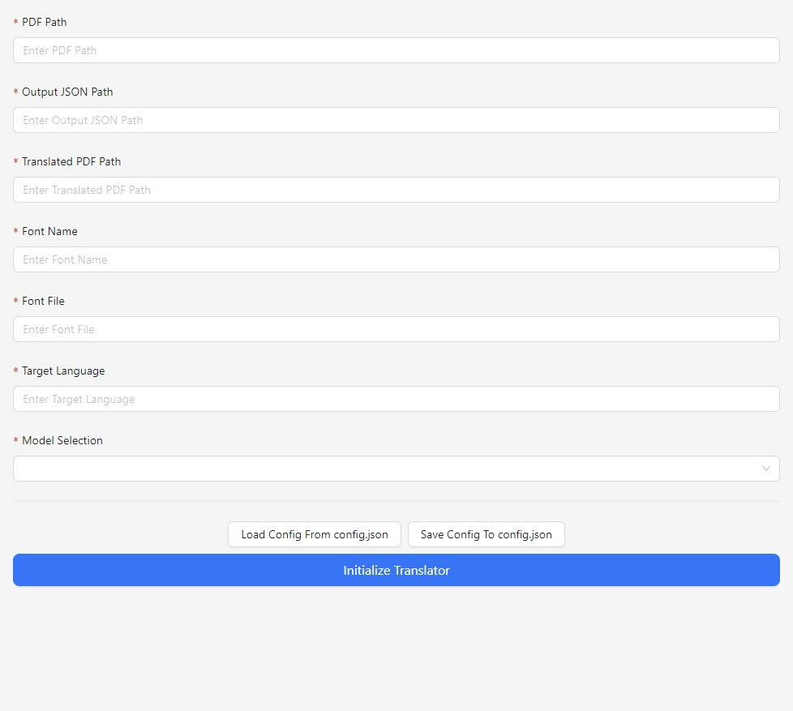
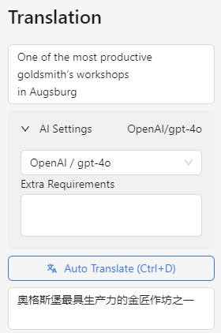
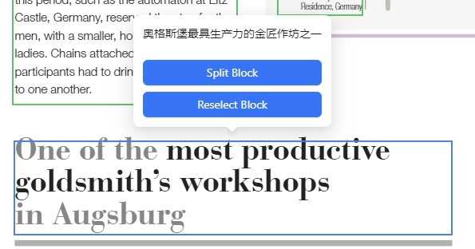
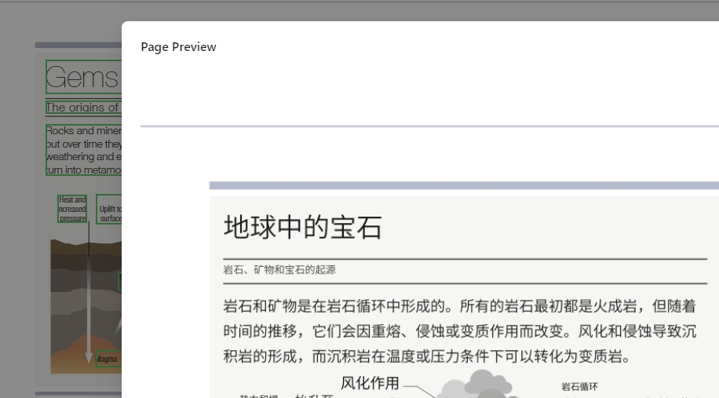

# pdf-visualize-translate

English | [简体中文](README_zh.md)

A visual PDF AI translation tool specifically designed for the need to maintain the original PDF text box locations while utilizing AI for rapid translation.

## Usage

Download the latest executable file from the Release page, unzip it, and double-click `PDF-Visualize-Translate.exe` to run. The program will automatically open a browser window at `http://127.0.0.1:5000`.

### AI Language Model Configuration
Rename the `llm_credentials_template.json` file to `llm_credentials.json`, and fill in your AI language model credentials in the `llm_credentials.json` file.

### Load Configuration
After opening the browser window, you will enter the configuration page (refreshing the page will also take you to the configuration page). After completing the configuration, click the `Initialize Translator` button, and the program will automatically load the configuration and enter the translation page.

#### PDF Path
Please place the PDF file you need to translate in the `pdf` folder, and then enter the relative path `./pdf/your-pdf-file.pdf` in the PDF Path text box on the page.

#### Output JSON Path
This is the file path for storing the translation results in JSON format. It can be any path, and it does not necessarily have to be in the `pdf` folder.

#### Translated PDF Path
This is the file path for storing the translated PDF file. It can be any path, and it does not necessarily have to be in the `pdf` folder.

#### Font Name
The name of the font to be rendered into the translated PDF.

#### Font File
The file path of the font to be rendered into the translated PDF. It can be any path, and it does not necessarily have to be in the `pdf` folder. A series of fonts such as `./font/SimplifiedChinese/SourceHanSansSC-Normal.otf` have been prepared in advance.

#### Target Language
The target language for translation. Generally, as long as the language is supported by the AI model you have chosen, it can be used.

#### Model Selection
Selection of AI model, choose according to the actual situation.

### Translation Page

After starting the translation, the program will automatically load the PDF pages and render them as shown in the figure below.

Text boxes that have already been translated will be marked in green, and those not yet translated will be marked in red. Clicking on any text box will fill the text content into the translation input box on the right, and clicking the `Auto Translate` button will automatically translate the content of the text box. You can choose different models for translation, or add additional translation requirements into the `Extra Requirements` input box.

#### Font Color
The RGB color value in pymupdf is a floating point number ranging from 0 to 1, for example, (0, 0, 0) is black, and (1, 1, 1) is white.

#### Adjust Text Box
Hovering the mouse over a text box will display the translated results and operation buttons, as shown in the figure.

Click `Reselect Block` or use the shortcut `Ctrl + E` to re-drag and select the position of the text box.

#### Preview Rendering Effect
Click the `Preview Page` button to preview the rendering effect of the current page.

