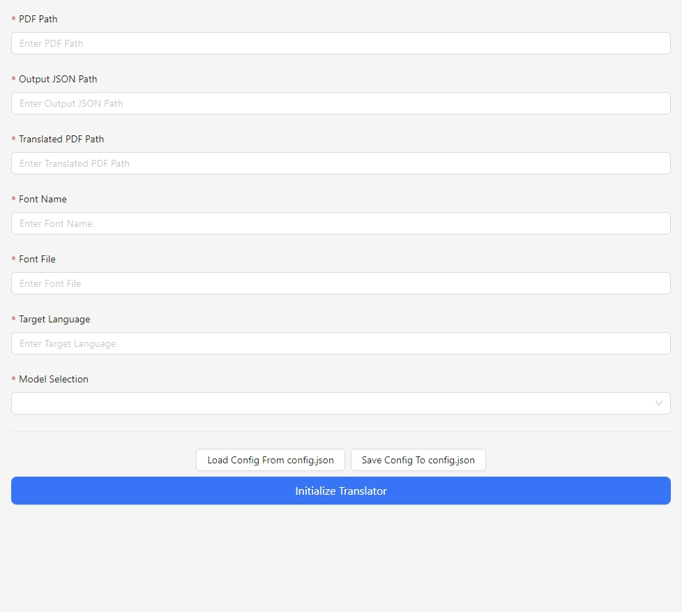
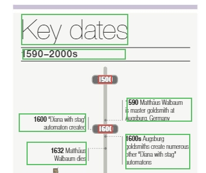
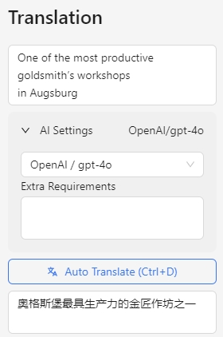
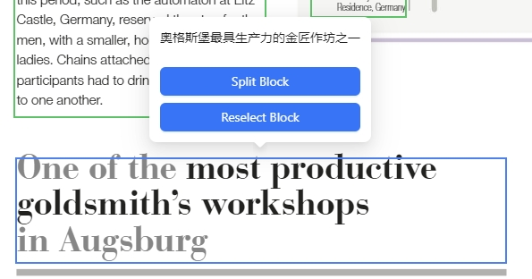

# pdf-visualize-translate

一个可视化的 PDF AI 翻译工具，专门针对需要保持原 PDF 文本框区域位置并利用 AI 快速进行翻译的需求。

## Usage

从 Release 页面下载最新版本的可执行文件，解压后双击 PDF-Visualize-Translate.ext 运行即可。程序会自动打开一个浏览器窗口 http://127.0.0.1:5000 。

### AI 语言模型配置
将 llm_credentials_template.json 文件改名为 llm_credentials.json，将你的 AI 语言模型的凭证填入 llm_credentials.json 文件中。
 
### 加载配置
打开浏览器窗口后会进入配置页面（刷新页面也会进入配置页面）。配置完成后点击 `Initialize Translator` 按钮，程序会自动加载配置并进入翻译页面。

#### PDF 路径
请将需要翻译的 PDF 文件放置在 `static` 文件夹下，然后在页面的 PDF Path 输入框中输入相对路径 `./static/your-pdf-file.pdf`。

#### Output JSON Path
这是用于储存翻译结果的 JSON 文件路径，任意路径均可，不一定要放在 `static` 文件夹下。

#### Translated PDF Path
这是用于储存翻译后的 PDF 文件路径，任意路径均可，不一定要放在 `static` 文件夹下。

#### Font Name
渲染到翻译后 PDF 里的字体名称。

#### Font File
渲染到翻译后 PDF 里的字体文件路径，任意路径均可，不一定要放在 `static` 文件夹下。目前提前准备了 `./font/SimplifiedChinese/SourceHanSansSC-Normal.otf` 系列字体。

#### Target Language
目标的翻译语言，一般来说只要你选择的 AI 模型支持的语言都可以。

#### Model Selection
AI 模型选择，根据实际情况选择。

### 翻译页面

开始翻译后，程序会自动加载 PDF 页面并渲染显示，如下图所示。

已经翻译完成的文本框会标记为绿色，未翻译的文本框会标记为红色。点击任意文本框会将文字内容填入右侧待翻译输入框，点击 `Auto Translate` 按钮会自动翻译该文本框内容。你可以选择不同的模型进行翻译，也可以增加额外的翻译要求填入 `Extra Requirements` 输入框。

#### 字体颜色
pymupdf 的 RGB 颜色值是 0-1 的浮点数，例如 (0, 0, 0) 是黑色，(1, 1, 1) 是白色。

#### 调整文本框
鼠标悬浮在文本框上会显示已翻译结果以及操作按钮，如下图。

点击 `Reselect Block` 或者用快捷键 `Ctrl + E` 可以重新拖拽选择文本框的位置。

#### 预览渲染效果
点击 `Preview Page` 按钮可以预览当前页面的渲染效果。

